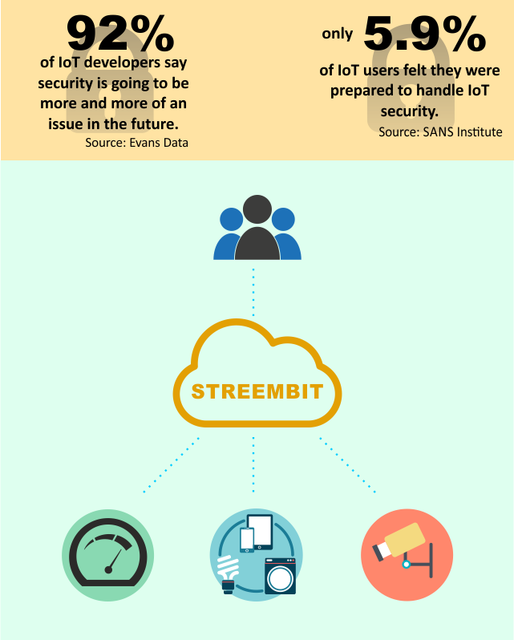

Security and discovery are two major system requirements in Internet of Things. Decentralized peer-to-peer computing could address both. Public/private key cryptography (PPKI) is a natural element of most decentralized system. PPKI and more specifically using the public key allows a simple but robust authentication and identity management on the network. 

Streembit also utilizes the concept of decentralized, peer-to-peer computing to perform device discovery. The actors of humans to machine as well as machine to machine communication must find each other on the Internet enabled networks in order to communicate. A decentralized system manages this tasks without using a centralized system or service. Streembit manages device discovery as well as authentication, access control and provisioning of devices without using a centralized authority server. The system facilitates device discovery and device control in a peer to peer manner. The owners and authorities in the centralized (client-server) topologies all have an influence upon the network and can be exploited. Streembit excludes third party service and cloud providers from the ecosystem to give full control to the end users over the devices.

-------

Check out the [other open source projects](https://github.com/zsoltpardi) I have contributed. You can contact me at zpardi@streembit.com if you have any questions or comments.
