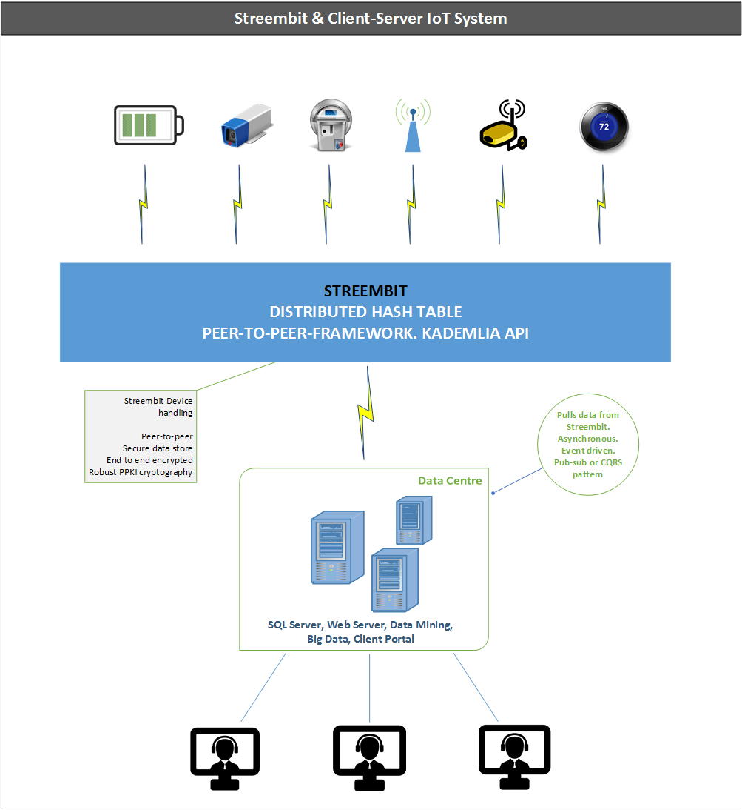

I've met experienced IoT developers, business analysts, business and project leaders in the last few weeks. We discussed Streembit, our open source, decentralized, peer-to-peer IoT application. Understandably, the first question was: why should anyone switch to a completely new topology from the well tested client-server paradigm? Why should a business throw away the existing infrastructure and invest into a new one? After all, the businesses have already invested into MS SQL, PostgreSQL, etc. data stores. Businesses use already centralized data mining and data analysis applications; client portals to serve end users via web applications – why should any business throw that away?

We don’t suggest that you replace the existing system with a completely new one.
Streembit complements and fits into your existing IoT infrastructure. We can
even add resilience to your design and take away the load of device handling
from your system. 

IoT devices which depend on servers for communication must cater for outages.
One of the most expensive challenges for IoT applications is to avoid a single
point of failure. Every server is a mission critical component. As such, it must
address scalability and availability requirements. with expensive load
balancing, clustering hardware, and software applications.  Further, centralized
communication nodes present a convenient target to eavesdrop for cyber
criminals.

Alternatively, IoT devices can publish the data to the Streembit distributed hash table instead of writing the data to a centralized web service or TCP/IP server. Then, the server can pull the data from the distributed storage. In this loosely coupled system the central server doesn’t have to be a mission critical, 99.9999% uptime component. It can be a lightweight system that pulls the data from the distributed storage. The system we propose is an event driven, asynchronous mechanism, pub-sub messaging and it implements the separation of concerns (SoC) design principle. The devices publish the data to the distributed storage and aren't concerned about the existence of the server. In such a topology the central server is not a single point of failure in the system anymore.   

Streembit can manage for you in this set-up:   

- Secure device authentication and access control   
- Secure messaging between the device and server   
- Secure device upgrade and management   

In case the commercial/industrial use case requires real time communication, it can be done via peer-to-peer and without the need of a central server. After all, we have said Streembit is a real time communication system between humans and machines.

-------

Check out the [other open source projects](https://github.com/zsoltpardi) I have contributed. You can contact me at tzpardi@streembit.com if you have any questions or comments.
