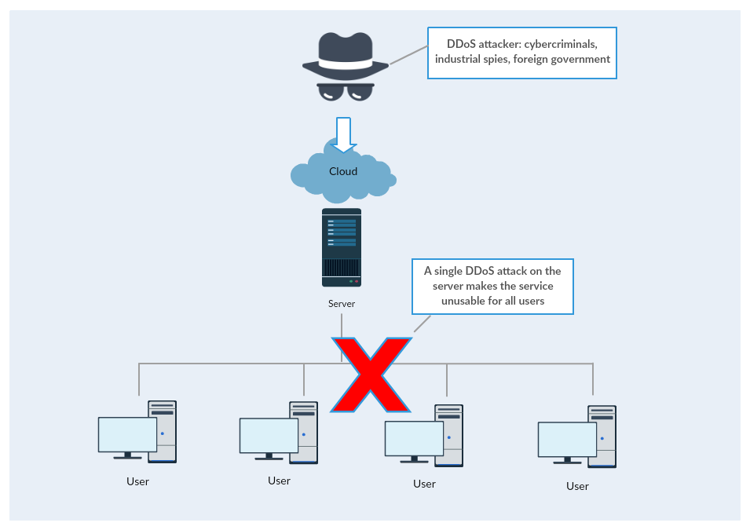
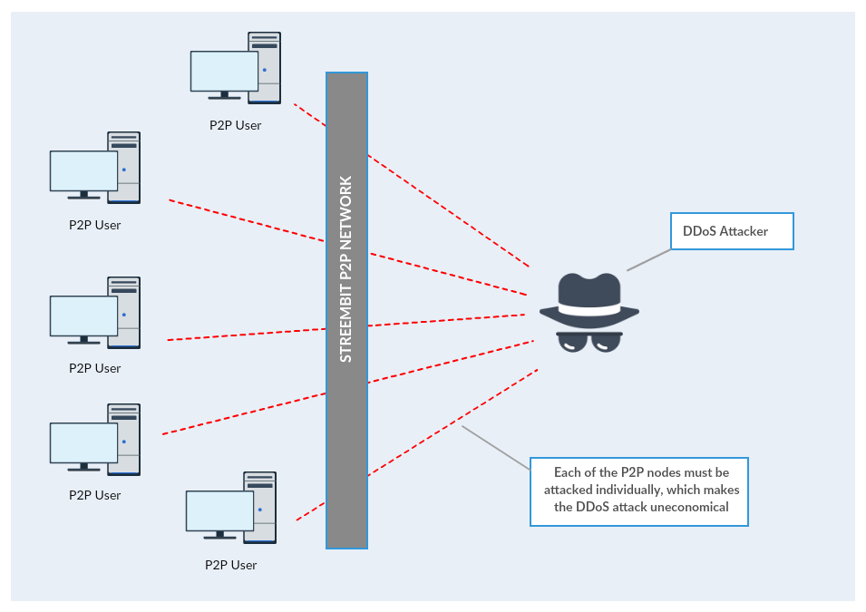

2017-01-04-Peer-networks-and-DDoS.md

---
layout: post
title: Mitigate DDoS attacks with P2P
subtitle: P2P networks make DDoS attacks uneconomical
author: "T Z Pardi"
categories: article
---

The enormous power of the September 2016 cyber attacks paralyzed the Internet along the US East Coast. The attack created problems for Internet users and afflicted an array of sites including Twitter, Amazon, Tumblr, Reddit, Spotify and Netflix. It was an extremely large and unusually distributed denial-of-service (DDoS) attack designed to knock many popular sites and services offline. The power of first attack reached 1.1 Tbps while a follow-on was 901 Gbps.  The DDoS attacks were delivered through a collection of hacked Internet-connected cameras and digital video recorders. With each one having the ability to bombard targets with 1 Mbps to 30 Mbps. Octave Klaba, the founder and CTO of OVH (his company was one of the prime targets of the attack) estimated the botnet had a capacity of 1.5 Tbps.

No centralized, client-server network can withstand such powerful attack. Furthermore no bank, government or internet connected IoT solution could handle these type of attacks using the traditional client-server model. No wonder the attack left millions of Twitter, Amazon and Netflix users without software services.

The only logical and available solution against such attacks is a decentralized peer-to-peer system. DDoS attack on a decentralized, P2P network wouldn’t be effective – no wonder Bitcoin has never experienced a network outage since the inception of the network.

In order to paralyze many millions of Netflix users the attackers have to concentrate their attacking power on the centralized Netflix servers. Once the attackers take out the server the clients (users) are without service. It is a relatively simple and doable task from the attacker's viewpoint and a very economical one as well - one concentrated attack can affect millions of users.

However, since there is no central server present in a P2P network, to deny the service the users of a decentralized, P2P network would have to be attacked individually. The 1 Tbps attacking power would have to be divided to attack each peer separately. This defies the economy of the attack. Therefore the configuration and orchestration of such attack on a P2P network would be impractical and highly uneconomical.

-> ### Attack on centralized services <-

-> ### Attack on P2P network <-

-------

Check out the [other open source projects](https://github.com/zsoltpardi) I have contributed. You can contact me at tzpardi@streembit.com if you have any questions or comments.

