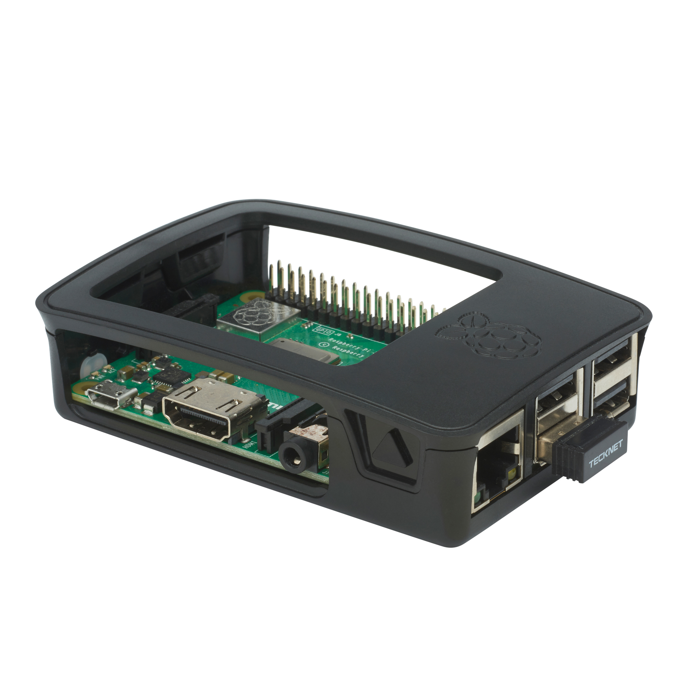
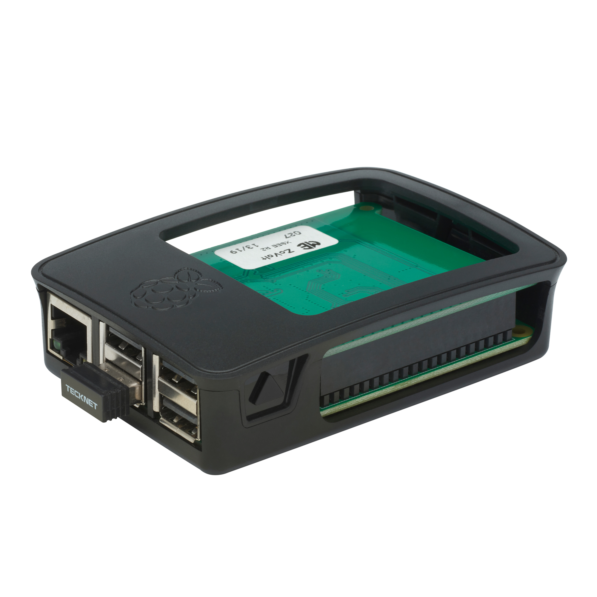
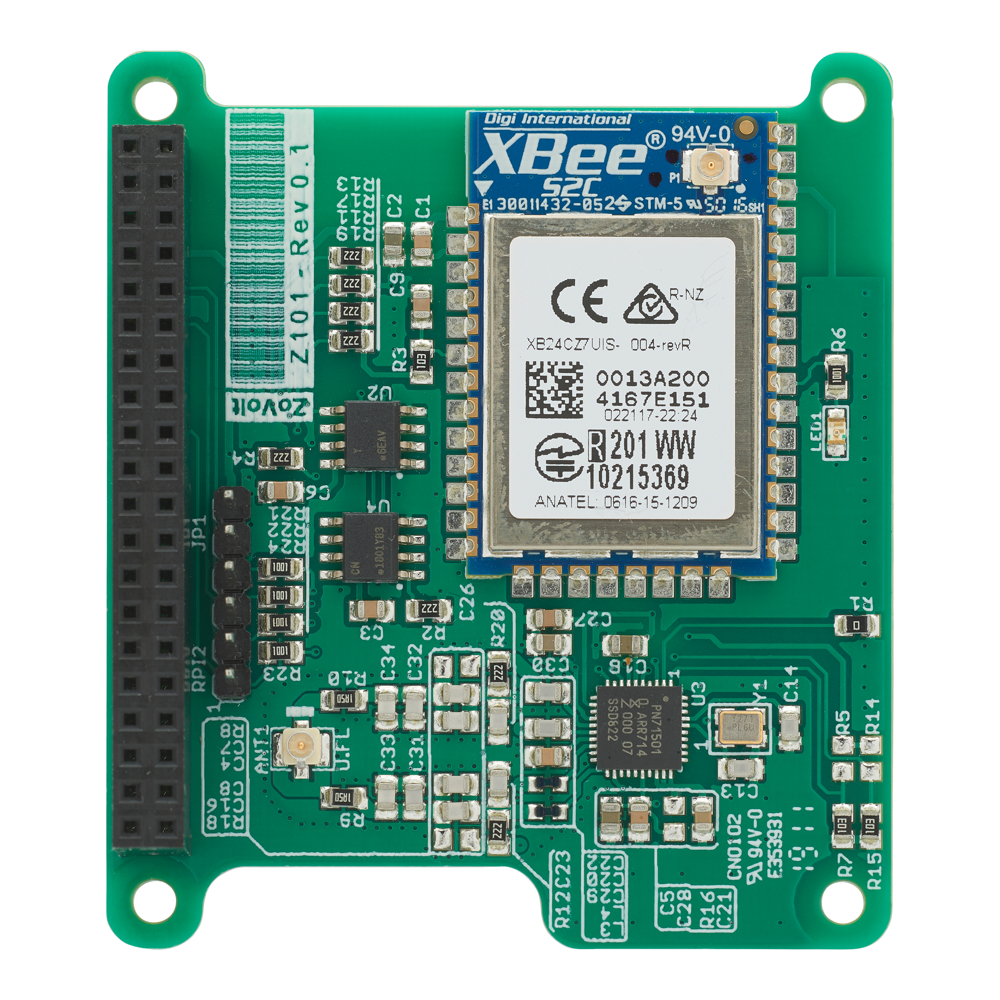

Those of you who have been following us at **Streembit** for the last 4+ years will know where our interest lies with regards to secure IOT and P2P.  It has been heads-down getting the development done since then but it occurs to us now that when we look back on those original blogs posted by @Tibor that, sadly, not much has really changed. _“Sadly”_ for users but perhaps _“timely”_ for us because we know that what we are doing is still very much of interest and has direct relevance to online activity and people’s lives now more than ever. 

Our technology is evolving, but let’s just revisit those use cases we espoused about a few years back and see if we can bring this back up to the current moment in time.

#### Use of Data?

With our development and sharing of Streembit we created the first fully P2P solution designed with human-machine communications in full view. The premise that, actually, there really should not be a prevailing requirement in online services that data is connected through third parties and that everyone is happy for these third parties to be remote, cloud or server based models.  Surely there is a time and place now for consumers to expect that data will be handled securely and that model puts us, as the user, in the driving seat? With IOT use cases such as vehicles we can see many potential areas that large automotive giants could start to use P2P (and Streembit) as the vehicle is really a combined set of sensors and data transfer on wheels.  The main points we highlighted in our original post were regarding the way that data is sent to and from a vehicle and how we believe this could be made more secure by P2P and also that we can use blockchain technology in parallel to create smart contracts and make the process more transparent, more auditable and more efficient.  We stand by these thoughts even today and it will be interesting to see how the vehicle and service industry moves along and if we can engage them.

#### Denial of service for millions?

This is something that has clearly not gone away and nor will it as long as we maintain a bias towards centralised computing and a reliance on server infrastructure. Much of the DDoS threat comes from a model where there is a single point of failure so enough traffic can be directed to one place and that in turn brings the network to a standstill.  It is clearly more complicated than that and we do not profess to be DDos security experts but the principle is solid.  So why do conventional users have this centralised approach to concept networks and network design? Well, it clearly makes companies a lot of money to host and _“secure”_ this data for their clients so that’s probably one of the biggest reasons but cynicism aside, it’s more likely just the convenience and that most end users don’t want to invest time in setting up P2P or getting fluent on what this means.  If I can buy a service from someone who will charge me x per month then why not?  So we understand this and in certain cases it still makes sense to do this but in many others it just doesn’t stack up.  If I have some critical infrastructure (I mean me, personally, rather than _“critical”_ as in nuclear or government) then it might be worth looking at P2P models to move it away from the likelihood of DDoS.  Criminal investigators know all too well that many thieves or cyber criminals will scan for the weak link (the factory setting _“admin”_ password; the ubiquitous password used across multiple domains and so forth) as they often have a lazy mindset.  In centralised models there is a single place (admittedly it could be more servers for large systems) to attack whereas in P2P we can have millions of nodes that are simply not economical to attack.  And they can spin up rapidly anyway to replace and heal the network.  We can use P2P to avoid single point of failure attacks by just making it awkward.  This hasn’t changed since we wrote our articles on the back of the first Streembit releases. 

#### Next generation IOT

Perhaps the one that is most confusing to us and somewhere we really want to see an upswing of interest for Streembit. IOT means lots of different things to different audiences but, again, if we talk about principles and high level here it’s still very clear to see that development in this space continues to be centralised and that it still brings with it myriad issues of security and data privacy. Commercial IOT networks are all-the-rage in _“Smart Cities”_ development and many teams are working on challenges of urban connectivity, 5G, sensors and data networks to provide planners and authorities with rich data that has some positive impact on their businesses or their lives.  It’s good stuff and there will undoubtedly be rewards to be had from this.  But, we ask ourselves, do we truly want all of this data to be collected in this way?  Are there situations where it would be better to set up a dedicated P2P network to control and connect to devices that are more sensitive or where there needs to be more public transparency?  If we look at consumer IOT it shines a light on what happens at the other end of the scale and not a week passes where there isn’t another report or alert about “Is your baby monitor letting bad people see your kids?” or “Just how connected and visible do you really want your fridge-freezer to be?”.  Some might argue a lot of it appears to be technology for the sake of technology and yet the industry is growing massively.  People want to be connected and have convenience opportunities.  They want their devices to be ever-connected.  But do we have to throw away our rights and expectations for privacy and the ownership of our data?  We think not.  With the upcoming launch of our Streembit Gateway for IOT we can start to make some noise initially within the developer community but then potentially (hopefully) into commercial and consumer IOT. 

--------

Our focus here is not on making mass consumer-grade commercial IOT solutions (not yet anyway) but to provide something to techies, developers and IOT enthusiasts to begin using and developing their own secure IOT solutions.  Our Streembit IOT Gateway “Developer Kit” comes with Zigbee sensors and the Raspberry Pi expansion board so there is everything you need to be able to start setting up using our [documentation](https://docs.streembit.co) and running your own P2P system.  Our hope is that we will develop a community of early adopters and developers who can start to see the potential of P2P IOT and provide genuine alternatives to the centralised IOT solutions we are seeing proliferate in homes and industry. 

### Streembit P2P IOT

-------

Check out the team behind Streembit [Zovolt Ltd](https://zovolt.com) If you are interested in being one of the “Early Birds” then drop us a note on (info@zovolt.com) and we will make sure you are top of the list when we release.
