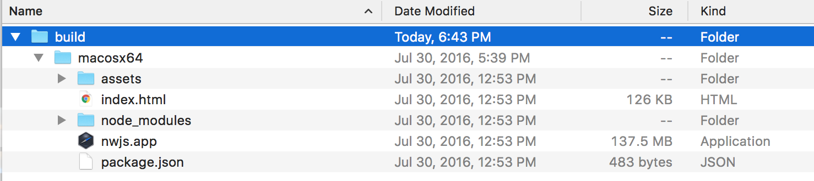

Windows 64-bit        
[Streembit v.1.2.0 Win64 executable](http://streembit.github.io/downloads/streembit_win64.zip)      
MD5 hash: a10698f39a42b0347213f3bc3e117a0e  

Linux 64-bit        
[Streembit v.1.2.0 Linux64 binaries](http://streembit.github.io/downloads/streembit_linux64.zip)      
MD5 hash: 93a3f2b272b1184aabd6b22cea8d02dc  

Mac OS X
Build is in progress ... please check later the availability of this file.


### Installation instructions
**To provide users with the most secure solution and to avoid placing dependencies on your computer the Streembit software is not an installed application. You can run the software by extracting the downloaded file and execute the Streembit binary.**   
Please follow the steps below to execute the application.

1. Download one of the above the compressed files which is relevant to your operating system (OS).
2. Extract the compressed file into any directory on your computer e.g. "C:\streembit" (on Windows) or "/home/username/streembit" on a Linux or Mac OS X machine.

Windows
-------
On Windows, right click on the streembit.exe file, select "Run as administrator" from the menu to execute the Streembit software.   
Optional: create a shortcut from the Streembit executable at your Desktop or Taskbar for quick access.


Linux
-----
Open the terminal.    
On Linux, change to the directory where the zip file was extracted.   

```
$ cd /path/to/extracted_files
```     

Execute the Streembit binary file.  

```
$ ./streembit
```   

Optional: create a [.desktop file](https://wiki.archlinux.org/index.php/Desktop_entries) for quick access.

Mac OS X
--------
Unzip the macosx64.zip file in the folder of your choice, for example the Desktop. A folder named streembit will be created. Double click that folder and you will see this directory structure:



Double click on nwjs.app to start Streembit.
